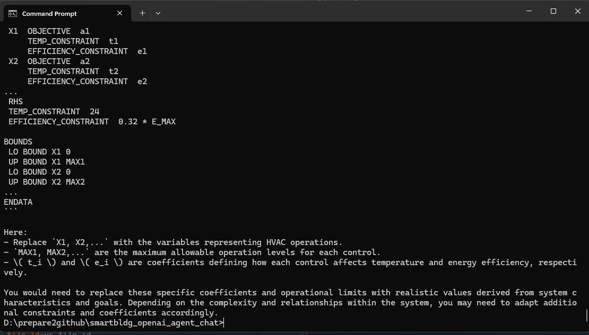
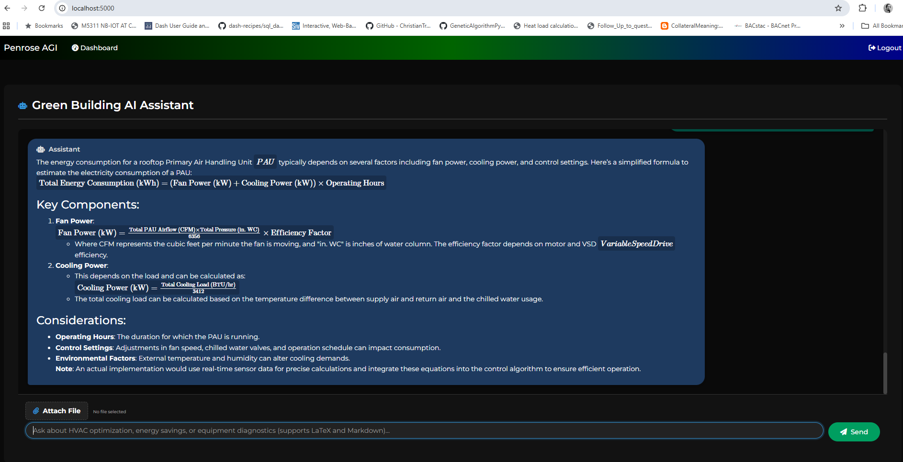

## OpenAI Agent: Smart Building Advisor (Chat App)
### *Ensure that you have the OPENAI_API_KEY in your system environment.
### Find any xlsx, docx, or pdf file/files as a base reference for your agent to answer questions.

app_singleton.py - simple agent to be run in cmd prompt (streaming output).

app_standard.py - flask app (non-agentic - converts file into strings).
app_vectorstore - flask app (agentic - uploads file into platform.openai.com as vectors)

